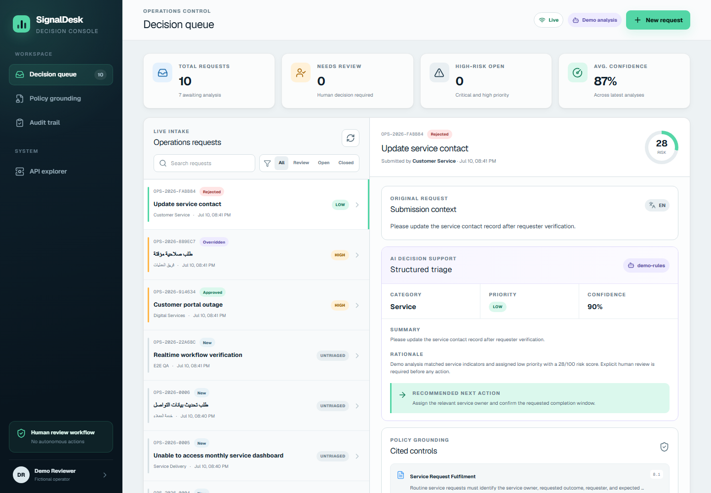
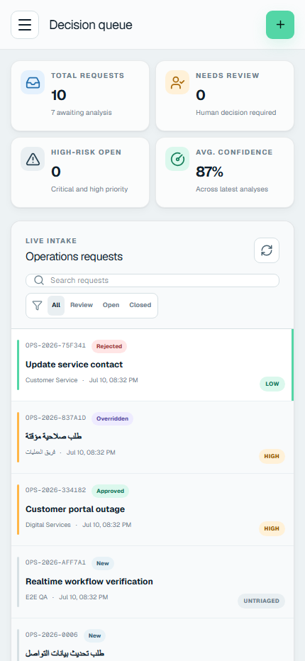
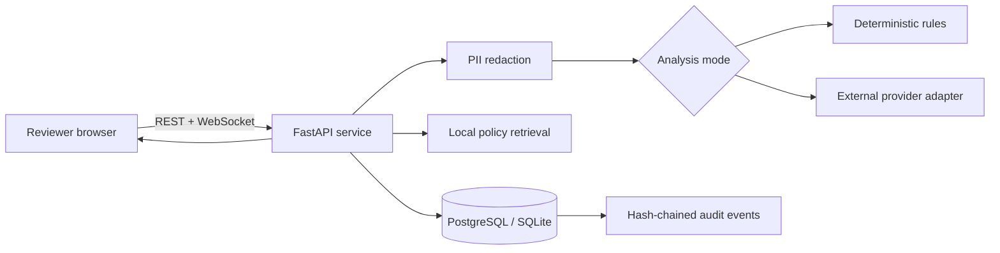

# SignalDesk

**A bilingual operations decision console for policy-grounded triage, human review, and tamper-evident audit history.**

[](https://github.com/ZaidNAlAsali/signaldesk/actions/workflows/ci.yml)

SignalDesk turns English and Arabic operational requests into structured categories, priorities, risk scores, recommended actions, and policy citations. AI provides decision support; the demo requires an explicit approve, reject, or override step, but does not authenticate reviewer identity.



<p align="center"></p>

## Why this project exists

Operational requests often arrive through fragmented channels with inconsistent urgency and little traceability. SignalDesk demonstrates a safer internal-tooling pattern:

1. Detect and redact common PII before analysis.
2. Classify the request using deterministic local rules or a schema-constrained external provider.
3. Retrieve relevant local policy passages in the request language.
4. Present evidence and uncertainty to a human reviewer.
5. Record every state transition in a per-case SHA-256 hash chain.
6. Push queue changes to connected clients through WebSockets.

It is a portfolio system, not a production service or a substitute for legal, security, or operational judgment.

## Engineering highlights

- **Full stack:** Next.js 16, React 19, TypeScript, FastAPI, Python, SQLAlchemy, and PostgreSQL.
- **Bilingual:** English and Arabic intake, Arabic-aware policy retrieval, RTL content, and responsive layouts.
- **Two analysis modes:** credential-free deterministic mode and a validated OpenAI-compatible provider adapter.
- **Provider safety:** PII redaction before egress, strict JSON schema responses, Pydantic validation, dependent risk checks, bounded retries, and safe errors.
- **Human control:** explicit approve, reject, and override workflows. Analysis never executes an operational action.
- **Policy evidence:** local citations include policy title, section, excerpt, language, and retrieval score.
- **Tamper evidence:** sequenced audit events store the previous hash and a canonical event hash. Verification identifies the first broken event.
- **Real time:** WebSocket queue events with explicit origin validation and heartbeat handling.
- **Delivery:** Alembic migrations, non-root Docker images, Docker Compose, health checks, GitHub Actions, dependency audits, and reproducible evaluation.

## Architecture



See [Architecture](docs/architecture.md), [Safety and security](docs/safety.md), and [Interview guide](docs/interview-guide.md).

## Quick start

### Prerequisites

- Python 3.11 or newer
- [uv](https://docs.astral.sh/uv/)
- Node.js 24
- npm

### API

```bash
cd services/api
uv sync --frozen --all-groups
uv run uvicorn signaldesk.main:app --reload
```

The default configuration uses a local ignored SQLite database, deterministic analysis, and fictional seed data. API docs are available at <http://localhost:8000/docs>.

### Web application

In a second terminal:

```bash
cd apps/web
npm ci
npm run dev
```

Open <http://localhost:3000>.

### Verify the local workflow

With both services running:

```bash
uv run scripts/e2e_smoke.py
```

The smoke test covers health/readiness, WebSockets, English analysis and approval, Arabic analysis and override, rejection, citations, and audit-chain verification.

## Docker Compose with PostgreSQL

```bash
docker compose up --build --wait
docker compose ps
uv run scripts/e2e_smoke.py
docker compose down --volumes
```

Compose starts PostgreSQL 17, applies Alembic migrations in a one-shot service before the API starts, seeds fictional data, and runs the frontend in production build/runtime mode. Ports bind to loopback by default because the demo has no authentication. Defaults are development-only and can be overridden through a local `.env` copied from `.env.example`.

## Analysis modes

### Deterministic mode

This is the default and requires no external credentials:

```bash
export SIGNALDESK_AI_PROVIDER=demo
```

It is deliberately transparent and reproducible. Keyword rules assign category, priority, and risk; local retrieval ranks policy passages.

### External provider mode

The adapter supports either the OpenAI Responses API or an OpenAI-compatible Chat Completions endpoint.

OpenAI Responses example:

```bash
export SIGNALDESK_AI_PROVIDER=openai
export SIGNALDESK_OPENAI_API_KEY='[set locally]'
export SIGNALDESK_OPENAI_MODEL=gpt-5-mini
export SIGNALDESK_OPENAI_BASE_URL=https://api.openai.com/v1
export SIGNALDESK_OPENAI_API_MODE=responses
export SIGNALDESK_PROVIDER_LABEL=openai
```

GitHub Models example:

```bash
export SIGNALDESK_AI_PROVIDER=openai
export SIGNALDESK_OPENAI_API_KEY="$(gh auth token)"
export SIGNALDESK_OPENAI_MODEL=openai/gpt-4.1-mini
export SIGNALDESK_OPENAI_BASE_URL=https://models.github.ai/inference
export SIGNALDESK_OPENAI_API_MODE=chat_completions
export SIGNALDESK_PROVIDER_LABEL=github-models
```

A live GitHub Models smoke report using two synthetic bilingual cases is checked in at [`services/api/eval/results/external-provider-smoke.json`](services/api/eval/results/external-provider-smoke.json). It verifies connectivity and schema handling, not general model quality.

## Configuration

All backend environment variables use the `SIGNALDESK_` prefix.

| Variable | Default | Purpose |
|---|---|---|
| `SIGNALDESK_AI_PROVIDER` | `demo` | `demo` or `openai` |
| `SIGNALDESK_DATABASE_URL` | `sqlite:///./signaldesk.db` | SQLAlchemy database URL |
| `SIGNALDESK_AUTO_CREATE_SCHEMA` | `true` | Local convenience only; Compose uses Alembic |
| `SIGNALDESK_SEED_DEMO_DATA` | `true` | Seed fictional policies and cases |
| `SIGNALDESK_CORS_ORIGINS` | localhost origins | Explicit browser origins |
| `SIGNALDESK_OPENAI_API_MODE` | `responses` | `responses` or `chat_completions` |
| `SIGNALDESK_PROVIDER_TIMEOUT_SECONDS` | `30` | External call timeout |
| `SIGNALDESK_PROVIDER_MAX_RETRIES` | `2` | Bounded retry count |
| `NEXT_PUBLIC_API_URL` | `http://localhost:8000` | Browser-visible API URL, fixed at frontend build time |

See [`.env.example`](.env.example) for the complete placeholder configuration. Never commit a real token or production connection string.

## Tests and quality checks

### Backend

```bash
cd services/api
uv run ruff check .
uv run ruff format --check .
uv run pytest --cov=signaldesk --cov-report=term-missing --cov-fail-under=80
uv run pip-audit
```

### Frontend

```bash
cd apps/web
npm test
npm run lint
npm run typecheck
npm run build
npm audit --audit-level=high
```

### Migrations

```bash
cd services/api
uv run alembic upgrade head
uv run alembic check
```

GitHub Actions is configured to run backend, frontend, secret-scan, and clean Docker Compose jobs on pushes to `main` and on pull requests.

## Evaluation and benchmark

Reproduce the authored bilingual regression evaluation:

```bash
cd services/api
uv run python -m scripts.evaluate --output eval/results/demo-evaluation.json
```

Current committed result: **24/24 authored cases pass** across category, priority, top policy, and expected redaction checks, including 14 English and 10 Arabic cases. This is a regression suite constructed around documented behavior. It is not a statistical estimate of production accuracy.

Reproduce the local deterministic benchmark:

```bash
uv run python -m scripts.benchmark --iterations 1000 --repeats 5 --output eval/results/demo-benchmark.json
```

Latest measured median on the development laptop: **917.64 operations/second**, with **0.961 ms p50**, **1.4411 ms p95**, and **1.6796 ms p99** latency over 5,000 operations. The benchmark covers redaction, deterministic classification, local policy retrieval, and Pydantic validation. It excludes HTTP, persistence, WebSockets, and external-provider latency. Hardware and background load affect the result.

## Security model

- Request text and requester names are redacted before external-provider transmission.
- Provider output is untrusted and must satisfy strict schemas and semantic risk bands.
- CORS origins, methods, and headers are explicit.
- WebSocket origins are validated.
- Application errors do not echo credentials or raw upstream responses.
- Audit history is **tamper-evident**, not immutable.
- The workflow requires an explicit human decision step, but reviewer identity is unauthenticated in this demo.
- Docker images declare non-root runtime users.

This demo has no authentication or role-based authorization and must not be exposed to untrusted networks as-is. See [Safety and security](docs/safety.md) and [Security policy](SECURITY.md).

## Known limitations

- No authentication, RBAC, tenant isolation, or production secrets manager.
- PII detection is pattern-based and cannot guarantee complete de-identification.
- Local keyword retrieval is intentionally small and not a semantic search system.
- Audit hashes detect modification but do not prevent a privileged database administrator from rewriting the chain.
- The external-provider smoke set is tiny and synthetic.
- SQLite is for local development and tests; PostgreSQL is the Compose deployment target.
- No public production deployment or usage claims are made.

## Repository map

```text
apps/web/                 Next.js application and Vitest tests
services/api/             FastAPI service, tests, policies, migrations, evaluation
scripts/e2e_smoke.py      Bilingual HTTP and WebSocket workflow verification
docs/                     Architecture, safety, interview notes, screenshots
compose.yaml              PostgreSQL, API, and web production-like stack
.github/workflows/ci.yml  CI, dependency audits, secret scan, Compose smoke test
```

## License

[MIT](LICENSE) © 2026 Zaid Al Asali
